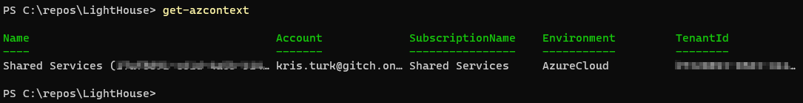
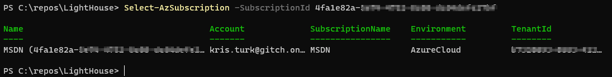
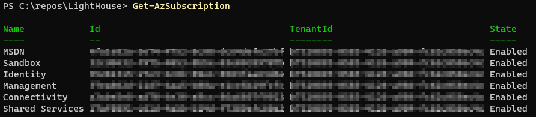
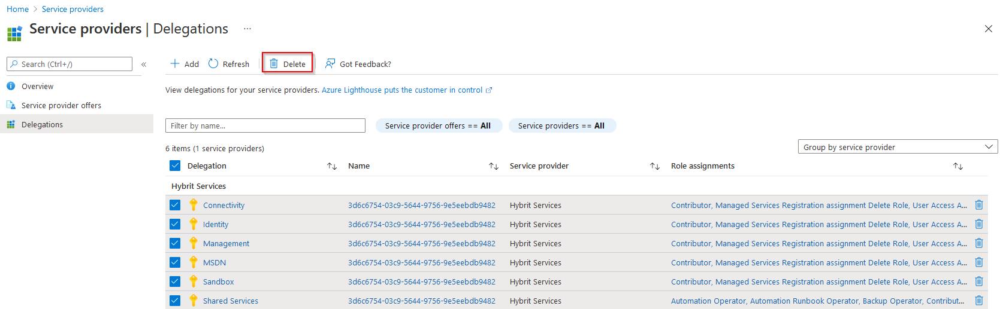
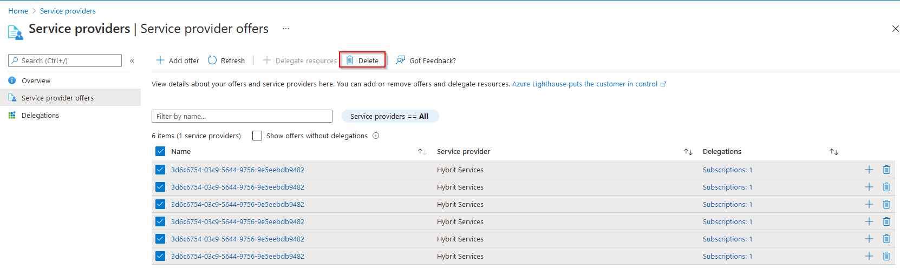

# Introduction

This Repository is intended for HybrIT Services Partners to easily and securely provide access to some or all subscriptions in their Azure Tenancy.

The Role base Azure Lighthouse configuration uses Privelege Groups in HybrIT's own AD Tenant. This provides a mechanism for auditable JIT privilege access at no additional cost to the partner.

https://azure.microsoft.com/en-gb/blog/privileged-identity-management-with-azure-lighthouse-enables-zero-trust/

This Feature was announced by Microsoft July 2021, for further reading please see Microsoft Azure Blog

- [Introduction](#introduction)
- [How to use](#how-to-use)
  - [Apply to Single Subscription](#apply-to-single-subscription)
  - [Apply to All Subscriptions](#apply-to-all-subscriptions)
- [What Roles get assigned and to who?](#what-roles-get-assigned-and-to-who)
  - [Roles](#roles)
  - [HybrIT Groups](#hybrit-groups)
  - [Role Assignment Summary Table](#role-assignment-summary-table)
  - [We only want to allow Reader at this stage](#we-only-want-to-allow-reader-at-this-stage)
    - [Apply to single subscription (reader only)](#apply-to-single-subscription-reader-only)
    - [Apply to all subscriptions (reader only)](#apply-to-all-subscriptions-reader-only)
- [Apply Backup Security (Resource Guard) to single subscription](#apply-backup-security-resource-guard-to-single-subscription)
- [Remove Access](#remove-access)

# How to use

1. Sign in to your Azure Tenancy using Windows PowerShell. Use an account that has owner rights against any subscriptions you want to enrol in Azure Lighthouse.

```
Connect-AzAccount
```

## Apply to Single Subscription

1. If you would like to HybrIT to only access a single subscription via Azure Light house check you are connected to the correct subscription

```
Get-AzContext
```



2. If you need to switch subscriptions you can use the below command

```
Select-AzSubscription -SubscriptionId <SubscriptionID>
```



3. Finally run the single powershell command to apply the template from this repository

```
New-AzSubscriptionDeployment -location uksouth -TemplateURI 'https://raw.githubusercontent.com/HybrIT-Services/AzureLighthouse/main/HybrITLightHouse.json'
```

## Apply to All Subscriptions

**Note: If you intend to use a seperate Subscription of Azure Resource Guard then ensure to deploy that subscription after running the below or apply one subscription at a time or exlude the Backup Security Subscription from the assignment**

1. To apply to all subscription that your signed in user has rights to run the below commands. Firstly check you can see the intented subscriptions from your PowerShell windows

```
Get-AzSubscription
```

You should see a return of the subscriptions you have access to.



2. Run the below script to assign to all subscriptions

```
$subs = Get-AzSubscription
foreach ($sub in $subs) {

    Select-AzSubscription -SubscriptionId $sub.Id
    New-AzSubscriptionDeployment -location uksouth -TemplateURI 'https://raw.githubusercontent.com/HybrIT-Services/AzureLighthouse/main/HybrITLightHouse.json'
}

```

3. If you need to exclude a subscription such as BackupSecurity filter it out with the below **ensure to check your subscription name**

```
$subs = Get-AzSubscription | Where-Object { $_.name -notlike "*BackupSecurity*" }
foreach ($sub in $subs) {

    Select-AzSubscription -SubscriptionId $sub.Id
    New-AzSubscriptionDeployment -location uksouth -TemplateURI 'https://raw.githubusercontent.com/HybrIT-Services/AzureLighthouse/main/HybrITLightHouse.json'
}

```

# What Roles get assigned and to who?

## Roles

The roles JSON template is built form the Bicep file in this repository. The bicep file contains comments to indicate which role is assigned to which group. The comments are intended to quicky interpret which groups get which roles with out the need to cross reference the Role Definition ID Manually. How ever if you would like to double check these roles can be found here.

https://docs.microsoft.com/en-us/azure/role-based-access-control/built-in-roles

## HybrIT Groups

HybrIT are using privlege access groups to provide access into your environment. This means no user or admin will have standing access. To gain access HybrIT's consultants will need to elevate themselves into the group using Privlege Identity Management with in the HybrIT Azure AD Tenant.
This has the benefit of having a full audit trail of who had access and when, additionally it means the licenses required for PIM are assigned within HybrIT's own Azure AD Tenant and incurs no cost to the Partner.

Additionally when elevating into groups with any kind of write privilege (all except reader) HybrIT's consultant will immediately be subject to MFA.

## Role Assignment Summary Table

| Privilelege Access Group                  | Role Assignment                              |
| ----------------------------------------- | -------------------------------------------- |
| Lighthouse - Azure Privilege Contributors | Contributor                                  |
| Lighthouse - Azure Privilege Contributors | Managed Services Registration assignment     |
| Lighthouse - Azure Privilege Contributors | Resource Policy Contributor                  |
| Lighthouse - Azure Privilege Contributors | Assign roles to Managed Identities           |
| Lighthouse - Azure Contributors           | Contributor                                  |
| Lighthouse - Azure Reader                 | Reader                                       |
| Lighthouse - Azure Operators              | Virtual Machine Contributor                  |
| Lighthouse - Azure Operators              | Backup Operator                              |
| Lighthouse - Azure Operators              | Reader                                       |
| Lighthouse - Azure Operators              | Log Analytics Contributor                    |
| Lighthouse - Azure Operators              | Monitoring Contributor                       |
| Lighthouse - Azure Operators              | Automation Operator                          |
| Lighthouse - Azure Operators              | Automation Runbook Operator                  |
| Lighthouse - Azure Operators              | Managed Application Operator                 |
| Lighthouse - Azure Operators              | Site Recovery Operator                       |
| Lighthouse - Azure Operators              | Desktop Virtualization User Session Operator |

## We only want to allow Reader at this stage

If your engagement with HybrIT is only in the discovery phases and read access is the only requirement then you can use the same script logic as the previous section as the previous section but reference the [HybrITReaderLighthouse.json](HybrITReaderLightHouse.Bicep) file.

For instructions on connecting and selecting single subscriptions please see earlier [instructions](#apply-to-single-subscription). The run the appropriate powershell command below

### Apply to single subscription (reader only)

```
New-AzSubscriptionDeployment -location uksouth -TemplateURI 'https://raw.githubusercontent.com/HybrIT-Services/AzureLighthouse/main/HybrITReaderLightHouse.json'
```

### Apply to all subscriptions (reader only)

```
$subs = Get-AzSubscription
foreach ($sub in $subs) {

    Select-AzSubscription -SubscriptionId $sub.Id
    New-AzSubscriptionDeployment -location uksouth -TemplateURI 'https://raw.githubusercontent.com/HybrIT-Services/AzureLighthouse/main/HybrITReaderLightHouse.json'
}

```

# Apply Backup Security (Resource Guard) to single subscription

If you require HybrIT to provide Multi-User authorization to protect your back up against "Critical Operations" such as preventing deletion by a bad actor then apply the below command against a dedicated Subscription that is used only for the purpose of Resource Guard. For more information see: https://docs.microsoft.com/en-us/azure/backup/multi-user-authorization

**Be Careful not to apply other lighthouse files to your BackupSecurity Subscription**

```
New-AzSubscriptionDeployment -location uksouth -TemplateURI 'https://raw.githubusercontent.com/HybrIT-Services/AzureLighthouse/main/HybrITSecureBackupLightHouse.json'
```

# Remove Access

Access can be removed at any time from the Portal or by using Azure PowerShell. To remove from Access from the portal use the search bar to find "Service Providers"

Under Delegations simply select and and **Delete**



To also clean up the left over "Offers" goto the **Service Provider offers** section. Again select all offers and click the **Delete** button.


